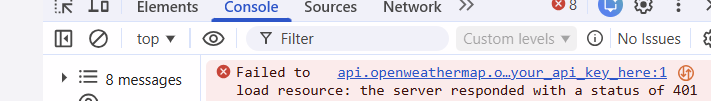
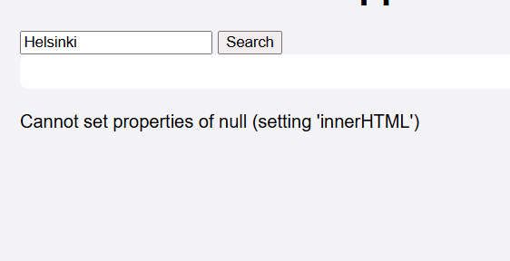

In the beggining of this project I started working with HTML structure. I needed to keep it simple and easy to connect with JavaScript. I focused on building a structure that supports the features of the weather app without adding unnecessary components. Here is the clean structure: [HTML bold stucture](image.png).
Before writing any code, I thought about what the page needs to contain: title, search bar and a button, section for current weather, a section for the 5-day forecast and elements like error messages or loading indicators. Added IDs to elements that JS can attach event listeners. The HTML includes empty containers and JS fills them with data. The error showing hidden element was added later. 

The next part was the hardest one. I had to google what comes nex and found, that I have to indicate DOM elements. Then added evenltListener nad other parts. The Copilot is a great helper, it shows suggested beginning of the code( that's why is good to make first) and shows the logic. After after folding the JS part I had some issues with the Open Weather accout 
And then, when I cheked the links and API adress, I've got  error message and after exploring this, it seem I have some mismatches in HTML (Cannot set properties of null).

After fixing those, the call wored properly. 

The last step was CSS file. The firs verson was simple: front, background color of the page and setted weather contaner front, color and soft rounderd corners. I wanted to move the header and search bar in to the center
For changes of apperance, I had to add to Header the class title. Also added centered apperance for title and searchbox. Also added hoover element in Title, search button and forecast item. 